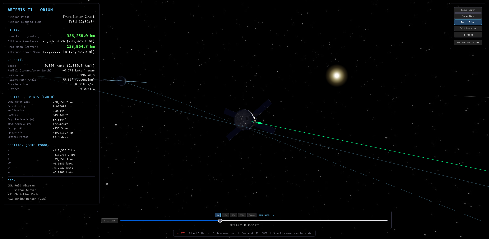

# Artemis II Live Tracker



Real-time 3D visualization of NASA's Artemis II mission to the Moon.

## Features

- **3D Earth-Moon-Orion visualization** with real trajectory data from JPL Horizons
- **Real-time position tracking** with interpolated updates every frame
- **Orbital mechanics data** - eccentricity, semi-major axis, inclination, perigee/apogee, true anomaly
- **Telemetry HUD** - altitude, velocity, radial/horizontal components, flight path angle, G-force, MET
- **Accurate celestial mechanics** - GMST-based Earth rotation, tidally locked Moon, correct Sun position
- **Spacecraft model** with simulated attitude (tail-to-Sun cruise, BBQ roll, prograde during burns)
- **Time controls** - live mode, time warp (1x to 3600x), scrub through entire mission
- **NASA TV mission audio** integration (when available)

## Data Source

All trajectory data from **JPL Horizons API** (ssd.jpl.nasa.gov):
- Spacecraft ID: **-1024** (Artemis II / Orion)
- Frame: ICRF J2000, Earth-centered
- Resolution: 1-minute intervals
- Coverage: April 2-11, 2026

## Run Locally

```
node serve.js
```

Then open http://localhost:3000

## Tech

- Three.js (r162) for 3D rendering
- JPL Horizons ephemeris data
- Zero dependencies (vanilla JS, no build step)

## Credits

- Trajectory data: NASA/JPL Horizons System
- Earth texture: NASA Blue Marble
- Moon texture: NASA/GSFC/LROC
- Orion 3D model: Sam Pedrotty (CC BY-SA 4.0)
